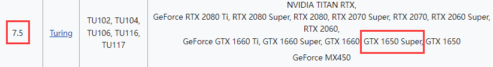
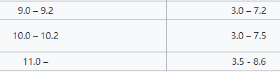
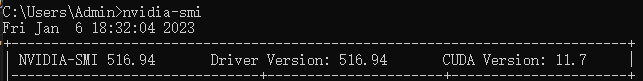

# VS2017编译opencv4.3.0（使用surf算法和yolov3）

之前写过一篇博客编译opencv4.3.0，目的是使用surf算法。而这一次不仅要使用surf算法，还要使用yolov3进行目标检测。由于目标检测用CPU跑不仅慢帧率还低，所以我们要用GPU跑。同样的darknet也用GPU版不然训练太慢。所以要重新编译一次opencv4.3.0。

## 编译平台/依赖

- win10 
- VS2017
- python3.7.5 
- Cmake-gui（3.15.1）
- opencv4.7.0 
- opencv_contrib-4.7.0（版本要和opencv一样）
- 一张显卡
- CUDA11.7（CUDA的版本计算能力要包含显卡的计算能力）
- CUDNN（版本要和CUDA10.2一样）


### 下载CUDA
为了让opencv yolov3使用GPU跑，要启用CUDA。  
我的显卡是1650s，根据[CUDA百科](https://zh.wikipedia.org/zh-sg/CUDA)，1650s的计算能力是7.5，而CUDA10.0以上的版本才支持7.5的计算能力，这里我选用CUDA10.2版本。




## 编译前准备

- [opencv4.7.0下载](https://opencv.org/releases/)
- [opencv_contrib-4.7.0到github下载](https://github.com/opencv/opencv_contrib/archive/refs/tags/4.7.0.zip)
- 下载安装CUDA

    >为了让opencv yolov3使用GPU跑，要启用CUDA。  
    我的显卡是1650s，根据[CUDA百科](https://zh.wikipedia.org/zh-sg/CUDA)，1650s的计算能力是7.5，而CUDA10.0以上的版本才支持7.5的计算能力，这里我选用CUDA12.0版本。
      
    
    <b>
    然后在命令行用nvidia-smi查看显卡驱动适配的最高CUDA版本
    
    可以看到显卡支持最高CUDA版本是11.7，你下载的CUDA版本必须低于该版本，这里我直接使用11.7
    [CUDA12.0下载](https://developer.nvidia.com/cuda-downloads?target_os=Windows&target_arch=x86_64&target_version=10&target_type=exe_local)

- 将cuDNN解压包内的include，bin，lib里的文件拷贝到CUDA对应的include，bin，lib内

CMake在配置的时候选择x64平台。
我的构建目录如下:
* CMake源目录是：`D:/lib/opencv-build/opencv-4.3.0`
* 输出目录是：`D:/lib/opencv-build/generate`
* 最后生成的dll等文件所在目录：`D:/lib/opencv-build/generate/install`


## CMake工具勾选
- BUILD_opencv_world
- OPENCV_ENABLE_NONFREE
- WITH_CUDA
- OPENCV_DNN_CUDA
- WITH_CUDNN （勾选CUDA configure后就会出现改选项）
- OPENCV_EXTRA_MODULES_PATH输入D:\lib\opencv-build\opencv_contrib-4.3.0\modules
- CUDA_ARCH_BIN只保留6.1 7.5

### 上面选项的作用
启用BUILD_opencv_world好处是只有一个dll，坏处是默认编译所有opencv模块，dll很大，release版在200M到300M左右。  
OPENCV_ENABLE_NONFREE是为了使用surf算法（特征匹配）。  
WITH_CUDA，OPENCV_DNN_CUDA，WITH_CUDNN是为了使用GPU版darknet或者GPU版opencv yolov3。  
OPENCV_EXTRA_MODULES_PATH指定额外模块的位置，该模块包含xfeature（使用surf算法）。  
CUDA_ARCH_BIN指定了CUDA计算能力，6.1，7.5分别对应1050显卡和1660s显卡。注意这里网上说能力越多生成的dll越大，所以如果你只使用一张显卡，那就勾选那张显卡对应的能力就行了。

## 编译流程
configure后generate,然后打开OpenCV.sln  
选择Debug和x64  
先生成opencv_world模块，大概用了30分钟，编译完会生成opencv_world430d.lib和opencv_world430d.dll  
然后生成ALL_BUILD，项目opencv_test_xfeatures2d会生成失败，这个项目我以为取消勾选BUILD_JAVA就不会有了，结果还是有问题，先不管了。  
最后生成INSTALL项目  
删除install目录里无用的文件，然后拷贝保存  
切换Release和x64再编译一遍  

## 编译时遇到的错误
### 错误1
> fatal error: boostdesc_bgm.i: vgg_generated_80. vgg_generated_120.i没有那个文件或目录

解决方法：下载下列文件，拷贝到opencv_contrib/modules/xfeatures2d/src/目录
```
boostdesc_bgm.i
boostdesc_bgm_bi.i
boostdesc_bgm_hd.i
boostdesc_lbgm.i
boostdesc_binboost_064.i
boostdesc_binboost_128.i
boostdesc_binboost_256.i
vgg_generated_120.i
vgg_generated_64.i
vgg_generated_80.i
vgg_generated_48.i
```

### 错误2
> Cannot open include file: 'features2d/test/test_detectors_regression.impl.hpp': No such file or directory

解决方法：将opencv-build\opencv-4.3.0\modules\features2d目录拷贝到opencv-build\generate（CMake生成目录）

