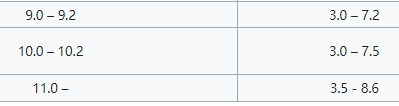
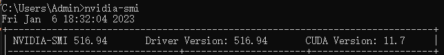

# VS2019编译opencv4.7.0（使用surf算法和yolov3）

之前写过一篇博客编译opencv4.3.0，目的是使用surf算法。而这一次不仅要使用surf算法，还要使用yolov3进行目标检测。由于目标检测用CPU跑不仅慢帧率还低，所以我们要用GPU跑。同样的darknet也用GPU版不然训练太慢。所以要重新编译一次opencv4.7.0。

## 编译平台/依赖

- win10 
- VS2019
- python3.7.5 （不要用VS下载python，VS没有debug版本的python）
- Cmake-gui（3.15.1）
- opencv4.7.0 
- opencv_contrib-4.7.0（版本要和opencv一样）
- 一张显卡
- CUDA11.6.2（CUDA的版本计算能力要包含显卡的计算能力）
- CUDNN（版本要和CUDA兼容）

### 编译前准备

- [opencv4.7.0下载](https://opencv.org/releases/)
- [opencv_contrib-4.7.0到github下载](https://github.com/opencv/opencv_contrib/archive/refs/tags/4.7.0.zip)
- CUDA下载安装

    >为了让opencv yolov3使用GPU跑，要启用CUDA。  
    我的显卡是1650s，根据[CUDA百科](https://zh.wikipedia.org/zh-sg/CUDA)，**1650s的计算能力是7.5，而CUDA10.0以上的版本才支持7.5的计算能力**。
      
    
    <b>
    然后在命令行用nvidia-smi查看显卡驱动适配的最高CUDA版本
    
    可以看到1650s显卡支持最高CUDA版本是11.7，你下载的CUDA版本必须低于该版本，这里我选用CUDA11.6.2版本。
    [CUDA官网（可能需要登录英伟达账号）](https://developer.nvidia.com/cuda-zone)
    [CUDA11.6.2下载](https://developer.download.nvidia.com/compute/cuda/11.7.0/local_installers/cuda_11.7.0_516.01_windows.exe)
    >#### 安装
    > 

- cuDNN下载解压并拷贝文件到CUDA目录
  >[cnDNN官网（可能需要登录英伟达账号）](https://developer.nvidia.com/cudnn)
  [cuDNN8.7.0下载](https://developer.nvidia.com/downloads/c118-cudnn-windows-8664-87084cuda11-archivezip)
  这里我直接下载兼容CUDA11.x的最新版本cuDNN8.7
  **下载完将cuDNN解压包内的include，bin，lib里的文件拷贝到CUDA对应的include，bin，lib内**

* 打开Cmake-gui，输入opencv源目录和输出目录，我的构建目录如下:

  * CMake源目录是：`D:/dev/up/opencv-4.7.0-build/opencv-4.3.0`
  * 输出目录是：`D:/lib/opencv-build/generate`
  * 最后生成的dll等文件所在目录：`D:/lib/opencv-build/generate/install`

* 点击configure，选择VS2019，x64平台（默认），配置过程比较慢。

## CMake选项
### 取消勾选
- [ ] JAVA相关选项
- [ ] test相关选项

### 勾选
- [ ] BUILD_opencv_world
- [x] OPENCV_ENABLE_NONFREE
- [x] WITH_CUDA
- [x] OPENCV_DNN_CUDA
- [x] OPENCV_EXTRA_MODULES_PATH 选择目录：[你的路径]/opencv_contrib-4.7.0/modules

勾选CUDA并且configure过一次后才会出现以下选项：
- [x] WITH_CUDNN 
- [x] CUDA_ARCH_BIN 只保留：7.5


### 上面选项的作用
>启用BUILD_opencv_world好处是只有一个dll，坏处是默认编译所有opencv模块，dll很大，release版在200M到300M左右。  
OPENCV_ENABLE_NONFREE是为了使用surf算法（特征匹配）。  
WITH_CUDA，OPENCV_DNN_CUDA，WITH_CUDNN是为了使用GPU版darknet或者GPU版opencv yolov3。  
OPENCV_EXTRA_MODULES_PATH指定额外模块的位置，该模块包含xfeature（使用surf算法）。  
CUDA_ARCH_BIN指定了CUDA计算能力，7.5对应1650s显卡。

## 编译流程
1. configure后generate,然后打开OpenCV.sln  
2. 选择Debug和x64  
3. 先生成opencv_world模块，大概用了30分钟，编译完会生成opencv_world470d.lib和opencv_world470d.dll  
4. 然后生成ALL_BUILD  
5. 最后生成INSTALL项目  
6. 删除install目录里无用的文件，然后将install拷贝到调用项目  
7. 切换Release和x64再编译一遍  

## 编译时遇到的错误
### 错误1
> fatal error: boostdesc_bgm.i: vgg_generated_80. vgg_generated_120.i没有那个文件或目录

解决方法：下载下列文件，拷贝到opencv_contrib/modules/xfeatures2d/src/目录
```
boostdesc_bgm.i
boostdesc_bgm_bi.i
boostdesc_bgm_hd.i
boostdesc_lbgm.i
boostdesc_binboost_064.i
boostdesc_binboost_128.i
boostdesc_binboost_256.i
vgg_generated_120.i
vgg_generated_64.i
vgg_generated_80.i
vgg_generated_48.i
```

### 错误2
> Cannot open include file: 'features2d/test/test_detectors_regression.impl.hpp': No such file or directory

解决方法：将opencv-build\opencv-4.3.0\modules\features2d目录拷贝到opencv-build\generate（CMake生成目录）

