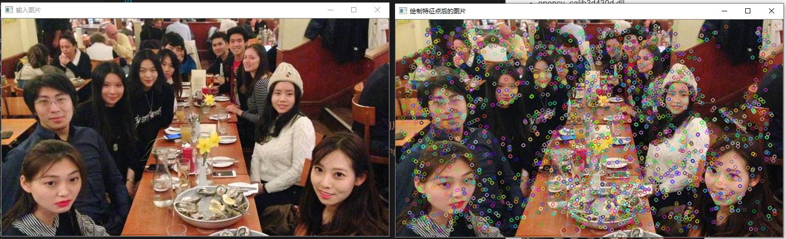
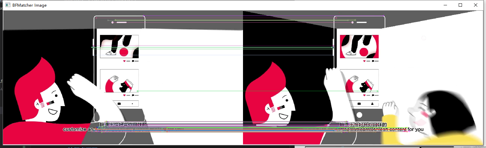
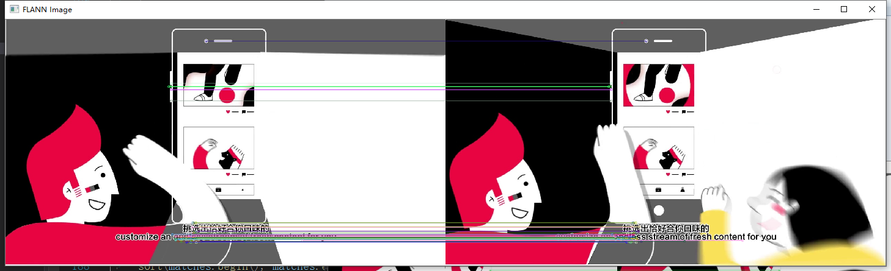
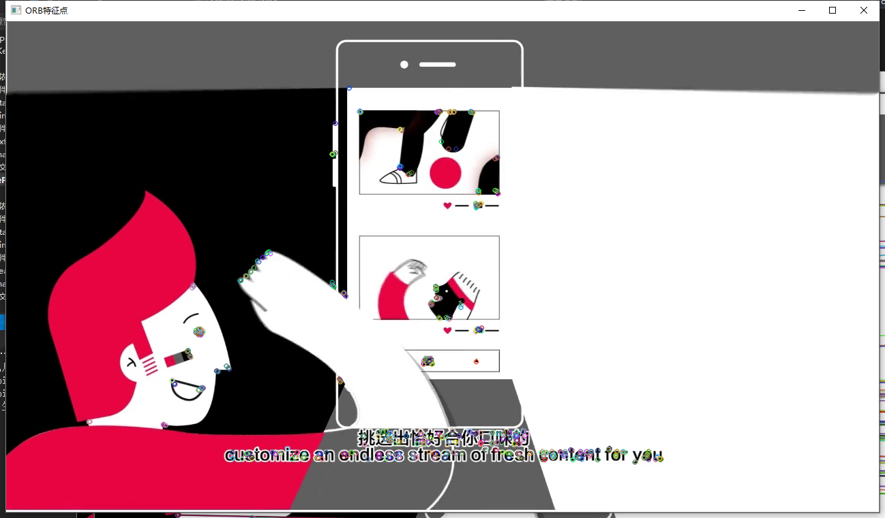
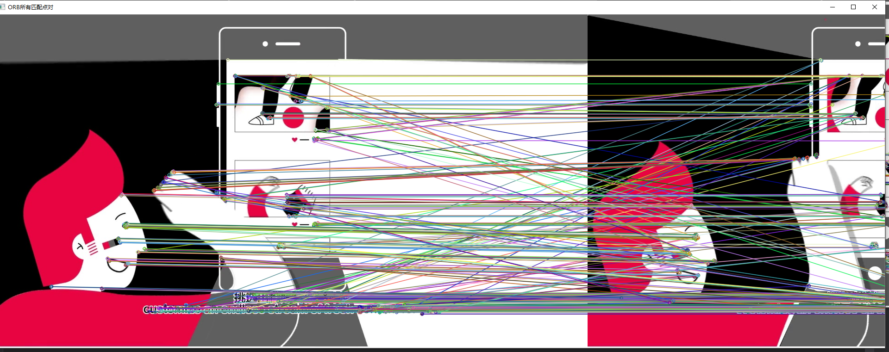
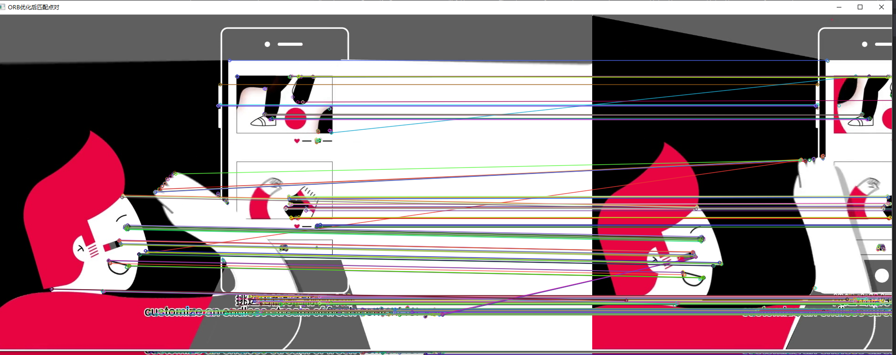

# 特征点提取/匹配

# 依赖opencv模块
* opencv_core430d.lib
* opencv_highgui430d.lib
* opencv_imgproc430d.lib
* opencv_imgcodecs430d.lib
* opencv_videoio430d.lib
* opencv_flann430d.lib（flan匹配）
* opencv_features2d430d.lib（orb算法依赖）
* opencv_calib3d430d.lib（计算透视变换矩阵）
* opencv_xfeatures2d430d.lib（SURF特征提取）

- opencv_core430d.dll
- opencv_highgui430d.dll
- opencv_imgproc430d.dll
- opencv_imgcodecs430d.dll
- opencv_videoio430d.dll
- opencv_videoio_ffmpeg430_64.dll（没有该dll不能打开视频）
- opencv_flann430d.dll
- opencv_features2d430d.dll
- opencv_calib3d430d.dll
- opencv_xfeatures2d430d.dll

# 原理

# 运行项目
VS将FeaturePointDemo设为启动项目，f5调试

## 特征点提取
代码实现：extractFeatureDemo函数
### 演示

## 特征点匹配
### 暴力匹配
代码实现：bfMatch函数  
设置了显示100个匹配点

### flann匹配
代码实现：flannMatch函数  
显示50个匹配点

### orb匹配
代码实现：orb函数  
匹配后图片宽度会超过屏幕显示宽度，而缩放图片会变形，所以不缩放  
ORB特征点并绘制

ORB所有匹配点对

ORB优化后匹配点对
