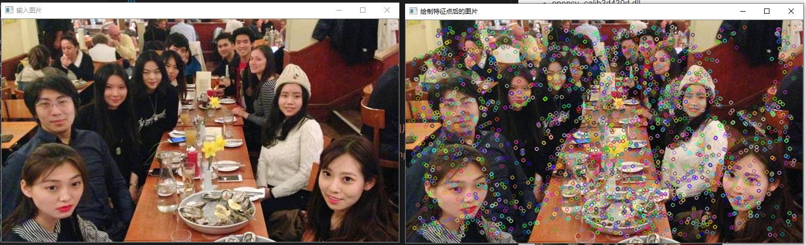

# 特征点提取/匹配/绘制/连线

# 开发环境
* win10
* vs2019（debug/x64）
* opencv-4.3.0

# 依赖opencv模块
* opencv_core430d.lib
* opencv_highgui430d.lib
* opencv_imgproc430d.lib
* opencv_imgcodecs430d.lib
* opencv_videoio430d.lib
* opencv_flann430d.lib（flan匹配）
* opencv_features2d430d.lib（orb算法依赖）
* opencv_calib3d430d.lib（计算透视变换矩阵）
* opencv_xfeatures2d430d.lib（SURF特征提取）

- opencv_core430d.dll
- opencv_highgui430d.dll
- opencv_imgproc430d.dll
- opencv_imgcodecs430d.dll
- opencv_videoio430d.dll
- opencv_videoio_ffmpeg430_64.dll（没有该dll不能打开视频）
- opencv_flann430d.dll
- opencv_features2d430d.dll
- opencv_calib3d430d.dll
- opencv_xfeatures2d430d.dll

# 原理

# 运行项目
VS将FeaturePointDemo设为启动项目，f5调试

## 特征点提取
### 演示效果

## 特征点匹配

## 特征点绘制

## 特征点连线